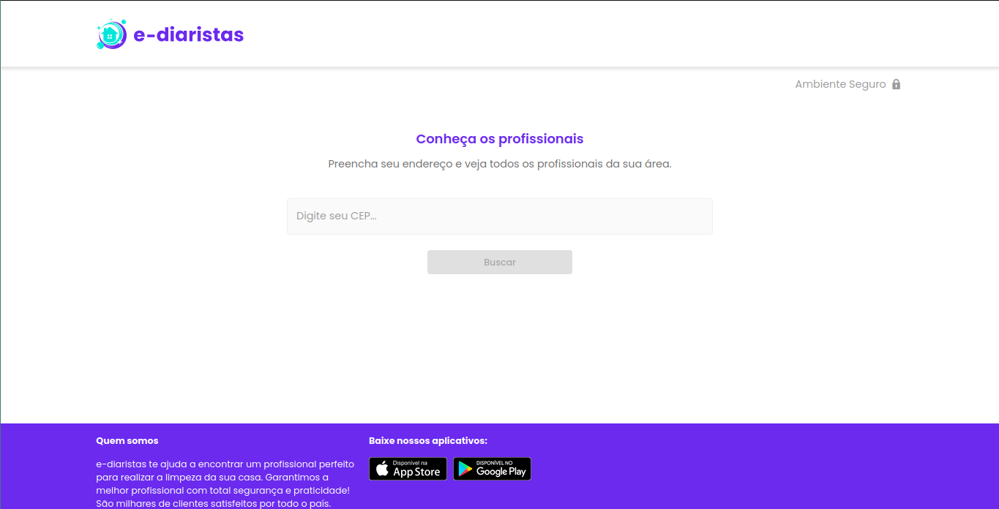
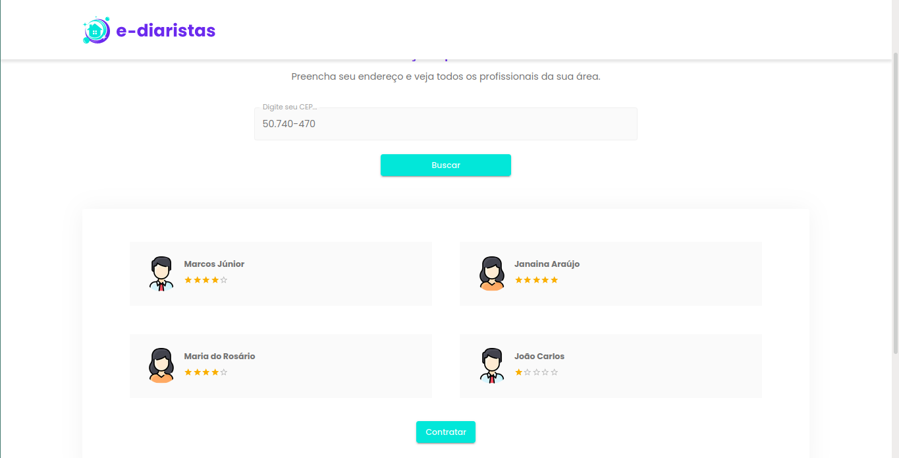

# multi-stack

Neste repositório encontra-se o projeto desenvolvido durante o BootCamp Multi-Stack promovido pela TreinaWeb, escola online para desenvolvedores.

No projeto fora desenvolvidos uma aplicação Web, com front-end em NodeJS, e back-end em Django, com a criação e utilização de API para conectar os serviços. 
Também foi desenvolvida uma aplicação mobile com ReactJS.

A aplicação tem como fim um site para cadastro e busca de diaristas por regiões em cidade. O serviço E-Diaristas solicita o CEP da região do cliente, e retorna 
todos os diaristas cadastrados naquela região, além de uma breve descrição e avaliação de cada um. A interface Web é adaptável para ser utilizada tanto em 
desktops como em celulares, de forma que o cliente tenha a melhor experiência ao acessar a aplicação.

A aplicação também utiliza a API do [ViaCEP](https://viacep.com.br/) para consultar a cidade referente ao CEP informado.
___
Aplicação Web: 

Aplicação Web após busca: 

Aplicação Web adaptiva a mobile: 

Back-end para cadastro e gerenciamento: 

